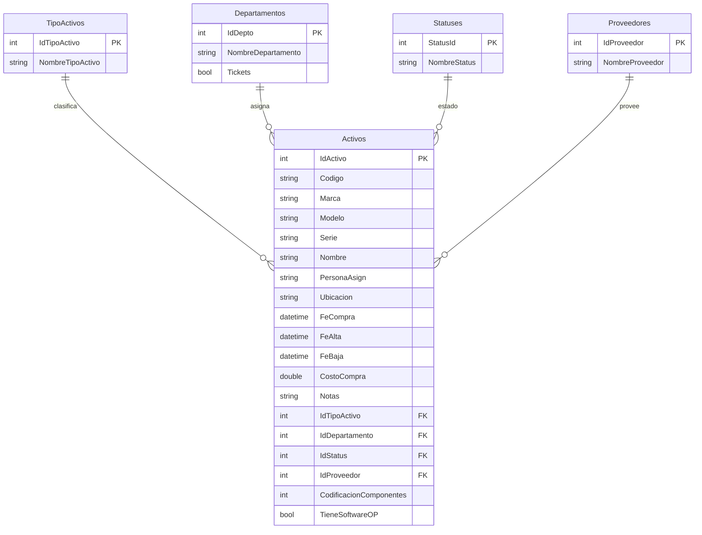

# ActivosApp + IndigoActivosAPI - Documentacion tecnica

Este README documenta la app MAUI ubicada en `ActivosApp` y la API ubicada en `C:\Users\Jorge\Documents\GitHub\IndigoActivosAPI\TicketsIndigoAssistsAPI`.

## Alcance

- App MAUI: consumo de la API (login, listado, detalle, crear, editar, borrar activos).
- API: endpoints expuestos, modelo de datos, relaciones y tecnologias.

## Tecnologias

App MAUI (`ActivosApp`)
- .NET MAUI (TargetFrameworks net10.0-android/ios/maccatalyst/windows)
- CommunityToolkit.Maui (toast/snackbar)
- Microsoft.Extensions.Http (HttpClientFactory)
- Microsoft.Extensions.Logging.Debug

API (`TicketsIndigoAssistsAPI`)
- ASP.NET Core 8 (Web API)
- Entity Framework Core 8
- Identity + JWT Bearer Authentication
- PostgreSQL (Npgsql)
- Swagger (Swashbuckle)
- CORS abierto para frontend MVC
- Health endpoint `/health`

## Configuracion y URLs

App MAUI
- Base URL: `http://31.97.131.142/` (configurada en `ActivosApp/MauiProgram.cs`)
- Usa token JWT en header `Authorization: Bearer <token>` (desde `SessionService`).

API
- Swagger UI: `/swagger`
- Health: `/health`
- JWT: configurado por `Jwt:Key`, `Jwt:Issuer`, `Jwt:Audience`, `Jwt:ExpirationMinutes`.

## Endpoints expuestos (API)

Autenticacion
- POST `/auth/register` (publico) - crea usuario Identity.
- POST `/auth/login` (publico) - retorna `accessToken`, `tokenType`, `expiresAtUtc`.

Activos (requiere JWT)
- GET `/activos` - lista resumen de activos.
- GET `/activos/{id}` - obtiene activo por id.
- POST `/activos` - crea activo.
- PUT `/activos/{id}` - actualiza activo.
- DELETE `/activos/{id}` - elimina activo.

Otros
- GET `/health` - estado de la API.
- GET `/swagger` - UI de Swagger.

## Endpoints consumidos por la app MAUI

`AuthService`
- POST `auth/login`
- POST `auth/register`

`ActivoService`
- GET `activos`
- GET `activos/{id}`
- POST `activos`
- PUT `activos/{id}`
- DELETE `activos/{id}`

## Modelo de datos (API)

Entidades principales
- `Activo`
- `TipoActivo`
- `Departamento`
- `Status`
- `Proveedor`

Identity (tablas estandar)
- `AspNetUsers`, `AspNetRoles`, `AspNetUserRoles`
- `AspNetUserClaims`, `AspNetRoleClaims`
- `AspNetUserLogins`, `AspNetUserTokens`

## Diagrama ER (Activos)

Notas de relaciones
- `Activo` tiene FKs opcionales a `TipoActivo`, `Departamento`, `Status` y `Proveedor`.
- `Codigo` en `Activos` es unico (indice unique en EF Core).

## Flujos principales (app MAUI)

- Login: `LoginPage` -> `AuthService.LoginAsync` -> guarda token en `SessionService`.
- Listado: `ActivosVistaPage` -> `ActivoService.ObtenerTodosAsync`.
- Detalle: `ActivoDetallePage` -> `ActivoService.ObtenerPorIdAsync`.
- Crear: `ActivoCreatePage` -> `ActivoService.CrearAsync`.
- Editar: `ActivoEditPage` -> `ActivoService.ActualizarAsync`.
- Borrar: `BorrarActivoPage` -> `ActivoService.EliminarAsync`.

## Notas de implementacion

- La API usa `[Authorize]` en `ActivosController`; requiere JWT valido.
- `AuthController` genera JWT con `accessToken` y `expiresAtUtc`.
- Al crear/editar un activo, la API puede crear automaticamente `TipoActivo`, `Departamento`, `Status` o `Proveedor` si no existe (cuando llega un nombre y no un ID).

## Referencias de codigo

App MAUI
- `ActivosApp/MauiProgram.cs`
- `ActivosApp/Services/ActivoService.cs`
- `ActivosApp/Services/AuthService.cs`
- `ActivosApp/Services/SessionService.cs`

API
- `TicketsIndigoAssistsAPI/Program.cs`
- `TicketsIndigoAssistsAPI/Controllers/ActivosController.cs`
- `TicketsIndigoAssistsAPI/Controllers/AuthController.cs`
- `TicketsIndigoAssistsAPI/Data/ApplicationDbContext.cs`
- `TicketsIndigoAssistsAPI/Models/Activo.cs`
