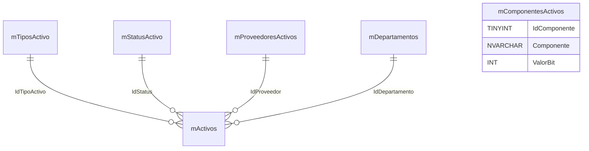
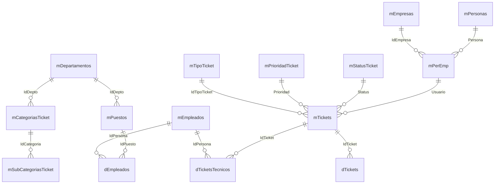
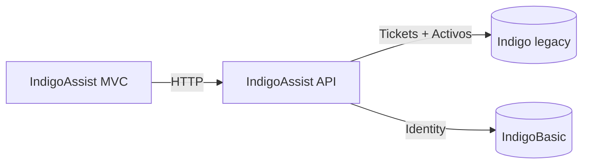

# IndigoAssist MVC

Aplicacion web MVC para gestionar tickets y activos, integrada con una API y una base legacy llamada Indigo.

## Que hace el proyecto
- UI MVC para operar tickets y activos.
- API para exponer operaciones de tickets, activos y catalogos.
- Tickets se leen/escriben en la BD legacy Indigo.
- Activos se leen/escriben en la BD legacy Indigo.
- Identity vive en IndigoBasic.

## Inicio rapido (solo Indigo preexistente)
Asume que ya tienes la BD Indigo con tickets y catalogos llenos.

1) Crear y preparar IndigoBasic (SQL primero)
- Ejecuta `IndigoAssistMVC/ScriptBD/IndigoBasic_Nueva.sql`
- Ejecuta `IndigoAssistMVC/ScriptBD/IndigoBasic_Seeders.sql`

2) Agregar tablas nuevas de Activos en Indigo (legacy)
- Ejecuta `SQL/Init.Project.sql`
  - Alternativa: `SQL/Activos.Schema.sql` y `SQL/Activos.Seeders.sql`
- Si la BD Indigo no tiene los SPs de tickets, ejecutar `SQL/Tickets.StoredProcedures.sql`
  - Incluye `usp_Tickets_Insert_Human` para insertar con datos humanizados

3) Migraciones de Identity (usuarios demo)
```bash
dotnet ef database update --project "IndigoAsists.Repositorio" --startup-project "IndigoAssistMVC" --context "IndigoAsists.Repositorio.Db.IndigoDbContext"
```

Notas para migraciones en Package Manager Console (Visual Studio)
- No escribas el prefijo `PM>` dentro del comando.
- En PMC se usan `Add-Migration` y `Update-Database` (no `dotnet ef`).
- Si la BD ya tiene tablas de Identity (por SQL), no uses `Add-Migration InitialBaseline` para crear tablas.
- Para baselinar una BD existente, usa:
  - `Add-Migration BaselineExistingDb -Project IndigoAsists.Repositorio -StartupProject IndigoAssistMVC -Context IndigoAsists.Repositorio.Db.IndigoDbContext -IgnoreChanges`
  - Luego aplica `Update-Database`.
- Si aparece el error "Ya hay un objeto con el nombre 'AspNetRoles'":
  - Elimina la migracion que intento crear tablas (`Remove-Migration`).
  - Vuelve a generar una migracion con `-IgnoreChanges`.
  - No vuelvas a ejecutar migraciones que creen tablas de Identity (ya existen por SQL).

4) Configurar conexiones

Notas para modo local (recomendado)
- Usa el entorno Development para que cargue `appsettings.Development.json` en MVC y API.
- Mantene coherentes las cadenas entre MVC y API para IndigoBasic (Identity) y Indigo (legacy).
- Si usas SQL Auth local, agrega `TrustServerCertificate=True` o `Encrypt=False` para evitar errores TLS.
- Si usas Windows Auth local, usa `Trusted_Connection=True` y elimina `User Id`/`Password`.
- Verifica que MVC apunte a la API local con `ApiSettings.BaseUrl`.
- Si no puedes iniciar sesion con usuarios seed, confirma que estas apuntando a la MISMA BD IndigoBasic.

Notas para servidor (Hostinger + Docker)
- Si SQL Server corre en un contenedor, usa el host/puerto expuesto del servidor:
  - Ejemplo: `Server=TU_IP_PUBLICA,1433;Database=IndigoBasic;User Id=sa;Password=TU_PASS;TrustServerCertificate=True;`
- Si el API esta en otro contenedor del mismo docker-compose, usa el nombre del servicio:
  - Ejemplo: `Server=sqlserver,1433;Database=Indigo;User Id=sa;Password=TU_PASS;TrustServerCertificate=True;`
- Verifica que el puerto 1433 este publicado en el host y permitido por el firewall.
- Para evitar TLS en demos, puedes usar `TrustServerCertificate=True` o `Encrypt=False`.
- Confirma que la BD en el servidor tiene los seeders aplicados (usuarios demo en IndigoBasic).

Notas para consumo de API en el mismo servidor (Hostinger, Ubuntu 24.04)
- Si MVC y API corren en la misma VM, puedes usar loopback:
  - `ApiSettings:BaseUrl = "http://127.0.0.1:PUERTO_API"`
- Si usas Nginx como reverse proxy, apunta al dominio/ruta publica:
  - `ApiSettings:BaseUrl = "https://tu-dominio.com"`
  - Si la API vive bajo un subpath: `https://tu-dominio.com/api` (ajusta los endpoints si aplica).
- Verifica que el puerto interno de la API coincida con `launchSettings` o el puerto del contenedor.
- Si publicas la API solo a localhost, el MVC debe estar en la misma VM/host para accederla.

MVC: `IndigoAssistMVC/appsettings.json`
```json
{
  "ConnectionStrings": {
    "DefaultConnection": "Server=TU_SERVIDOR;Database=IndigoBasic;Trusted_Connection=True;MultipleActiveResultSets=true;TrustServerCertificate=True"
  },
  "ApiSettings": {
    "BaseUrl": "http://localhost:5124"
  }
}
```

API: `IndigoAssits.API/appsettings.json`
```json
{
  "ConnectionStrings": {
    "DefaultConnection": "Server=TU_SERVIDOR;Database=IndigoBasic;Trusted_Connection=True;MultipleActiveResultSets=true;TrustServerCertificate=True"
  },
  "LegacyConnectionStrings": {
    "GDL": "Server=TU_SERVIDOR;Database=Indigo;Trusted_Connection=True;MultipleActiveResultSets=true;TrustServerCertificate=True"
  },
  "Jwt": {
    "Issuer": "IndigoAssist",
    "Audience": "IndigoAssistClients",
    "Key": "REEMPLAZAR_POR_CLAVE_SECRETA_SEGURA",
    "AccessTokenMinutes": 60
  }
}
```

5) Ejecutar API y MVC
```bash
cd IndigoAssits.API
dotnet run
```
```bash
cd IndigoAssistMVC
dotnet run
```

Puertos esperados (por defecto)
- API HTTP: `http://localhost:5124`
- API HTTPS (solo perfil https): `https://localhost:7167`
- MVC: `http://localhost:5212`

Si Swagger no abre en `https://localhost:7167`:
- Verifica que el perfil activo del API sea https (o usa `http://localhost:5124/swagger`).
- Revisa `IndigoAssits.API/Properties/launchSettings.json` para confirmar puertos.

Perfiles de ejecucion (Project vs IIS Express)
- Profile "Project": usa `applicationUrl` del `launchSettings.json`.
- Profile "IIS Express": usa `iisSettings.iisExpress.applicationUrl` y `sslPort`.
- Si ves 404 en recursos, confirma que el navegador apunte al puerto del perfil activo.
- En Visual Studio, el perfil activo se ve en la barra superior (selector de perfil).

Header requerido para la API (legacy):
```
X-Sucursal: GDL
```

Usuarios demo (migraciones Identity)
- admin@indigo.com / Password123!
- supervisor@indigo.com / Password123!
- tecnico@indigo.com / Password123!
- usuario@indigo.com / Password123!

## Tablas usadas - Activos (Indigo legacy)
Catalogos principales:
- `mTiposActivo` (tipo de activo)
- `mStatusActivo` (status del activo)
- `mProveedoresActivos` (proveedores)
- `mComponentesActivos` (componentes y valor bit)
- `mDepartamentos` (departamentos)

Datos de activos:
- `mActivos` (activos, FK a tipo, status, proveedor, departamento)

### Relaciones (Activos)


## Tablas usadas - Tickets (Indigo legacy)
Tablas principales:
- `mTickets` (ticket principal)
- `dTickets` (bitacora/anotaciones)
- `dTicketsTecnicos` (asignacion de tecnicos)

Catalogos:
- `mStatusTicket`
- `mPrioridadTicket`
- `mTipoTicket`
- `mCategoriasTicket`
- `mSubCategoriasTicket`

Personas y empleados:
- `mPersonas`, `mEmpresas`, `mPerEmp`, `mEmpleados`, `dEmpleados`, `mPuestos`, `mDepartamentos`

Vistas y funciones:
- `vTickets` (vista principal)
- `GetAnotacionesTecnicosTicket`
- `GetSysVar`

### Relaciones (Tickets)


## Diagrama de flujo (sencillo)


## API
La documentacion completa de endpoints esta en `IndigoAssits.API/README.md`.

## Resumen completo - Deploy IndigoAssist en VPS Hostinger (API + MVC + SQL Server + Nginx)

Infraestructura final operativa

Componente | Estado | Detalle
---|---|---
VPS | OK | Ubuntu 24.04 - IP 31.97.131.142
SQL Server | OK | Docker - puerto interno 127.0.0.1:1433
API .NET | OK | systemd - puerto 5000
MVC .NET | OK | systemd - puerto 5002
Nginx | OK | Reverse proxy / y /api
Login MVC | OK | Identity + SQL funcionando
Swagger | OK | publico via Nginx
DataProtection | OK | persistente

Arquitectura final

Internet
  |
  v
Nginx :80
  |
  |-- /     -> MVC (127.0.0.1:5002)
  |-- /api  -> API (127.0.0.1:5000)
             |
             v
        SQL Server (Docker)
        127.0.0.1:1433

Fase 1 - Deploy base

Problema
- API y MVC no corrian correctamente.

Causa
- Faltaban servicios systemd, configuracion de runtime y ConnectionStrings correctos.

Solucion
- Se crearon servicios:
  - API: `/etc/systemd/system/tickets-api.service`
  - MVC: `/etc/systemd/system/tickets-mvc.service`
- Se iniciaron:
  - `systemctl daemon-reload`
  - `systemctl start tickets-api`
  - `systemctl start tickets-mvc`

Fase 2 - Crash API

Error
- Failed to load configuration from file appsettings.json
- JsonReaderException

Causa raiz
- JSON invalido en `/srv/apps/api/appsettings.json`.

Solucion
- Correccion del JSON.

Resultado
- OK API levanta correctamente
- OK Swagger responde

Fase 3 - Nginx mal configurado

Problema
- Todo el trafico iba a API, MVC no respondia.

Config original
```
location /
proxy_pass http://127.0.0.1:5000;
```

Solucion
- Configuracion correcta:
  - Archivo: `/etc/nginx/sites-available/tickets-api`
  - Config final:
```
server {
  listen 80;
  server_name _;

  location /api/ {
    proxy_pass http://127.0.0.1:5000/;
  }

  location /swagger/ {
    proxy_pass http://127.0.0.1:5000/swagger/;
  }

  location / {
    proxy_pass http://127.0.0.1:5002/;
  }
}
```

Resultado
- OK MVC publico
- OK API publico
- OK Swagger publico

Fase 4 - MVC no logeaba

Error
- Pantalla: An error occurred while processing your request
- Log real: SqlException: Login failed for user 'sa' (Error 18456)

Causa raiz
- ConnectionString incorrecto en MVC:
  - Password=123456
- Password correcto:
  - PasswordFuerte123!

Solucion
- Correccion en `/srv/apps/mvc/appsettings.json`.

Resultado
- OK MVC conecta a SQL correctamente

Fase 5 - Antiforgery token could not be decrypted

Error
- AntiforgeryValidationException
- The key was not found in the key ring

Causa raiz
- DataProtection usando keys en memoria:
  - Using an in-memory repository
- Esto rompe login despues de reinicio.

Solucion
- Persistencia de keys.
- Crear directorio: `/var/lib/indigoassist/dataprotection`
- Permisos:
  - `chown www-data:www-data /var/lib/indigoassist/dataprotection`
  - `chmod 700 /var/lib/indigoassist/dataprotection`
- Codigo agregado en Program.cs:
```
builder.Services.AddDataProtection()
    .PersistKeysToFileSystem(new DirectoryInfo("/var/lib/indigoassist/dataprotection"))
    .SetApplicationName("IndigoAssist");
```

Resultado
- OK Antiforgery funcional
- OK Login funcional
- OK Cookies persistentes

Fase 6 - Configuracion correcta ApiSettings

Problema
- MVC apuntaba a localhost:5124 (entorno local, no VPS).

Solucion
```
"ApiSettings": {
  "BaseUrl": "http://127.0.0.1:5000"
}
```

Resultado
- OK MVC consume API correctamente

Estado final

Todo funcionando correctamente:

Funcion | Estado
---|---
MVC carga | OK
Login | OK
API responde | OK
Swagger responde | OK
SQL conectado | OK
Nginx routing correcto | OK
Persistencia cookies | OK

Endpoints finales

MVC
- http://31.97.131.142/

API
- http://31.97.131.142/api/Auth/login

Swagger
- http://31.97.131.142/swagger/index.html

Servicios operativos

Ver estado
- `systemctl status tickets-api`
- `systemctl status tickets-mvc`

Reiniciar
- `systemctl restart tickets-api`
- `systemctl restart tickets-mvc`

Archivos criticos

API
- `/srv/apps/api/appsettings.json`

MVC
- `/srv/apps/mvc/appsettings.json`

Nginx
- `/etc/nginx/sites-available/tickets-api`

DataProtection
- `/var/lib/indigoassist/dataprotection`

Estado final del sistema
- Sistema completamente funcional y estable en produccion.
