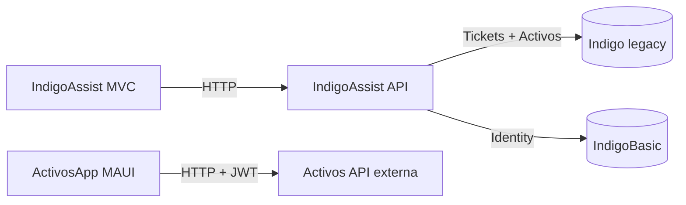
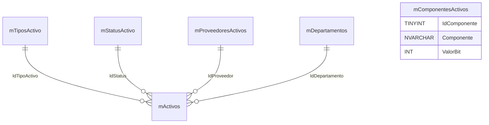
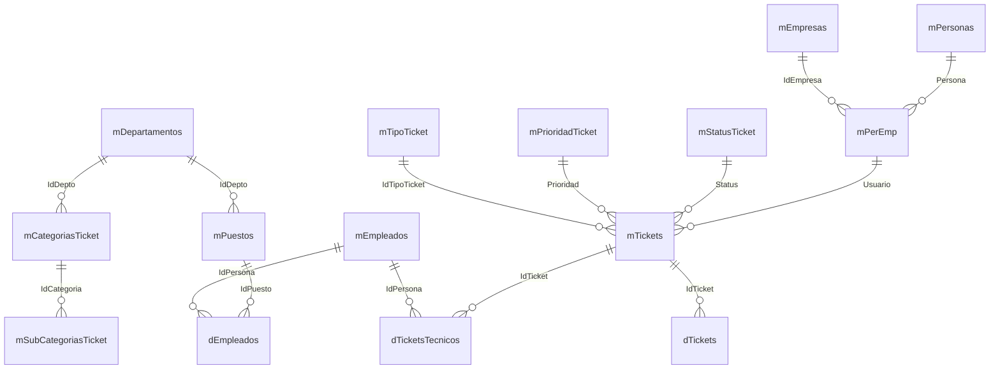

# IndigoAssist - Plataforma de tickets y activos

Suite de aplicaciones .NET para gestionar tickets de soporte y activos empresariales. Incluye una web MVC, una API REST y una app MAUI, con integracion a bases de datos legacy y un esquema de identidad separado.

## Contenido del repositorio

- `IndigoAssistsMVC/`: solucion principal (MVC + API + capa de negocio + repositorio).
- `IndigoAssistsMVC/IndigoAssistMVC/`: UI web MVC.
- `IndigoAssistsMVC/IndigoAssits.API/`: API REST para tickets, activos y catalogos.
- `IndigoAssistsMVC/IndigoAssitsReglasDeNegocio/`: servicios de negocio.
- `IndigoAssistsMVC/IndigoAsists.Repositorio/`: EF Core, UnitOfWork y repositorios.
- `IndigoAssistsMVC/SQL/`: scripts de base de datos legacy (Indigo).
- `IndigoAssistsMAUI/ActivosApp/`: app MAUI para gestionar activos.
- `Documentacion/`: documentos y diagramas del proyecto.

## Arquitectura general

Notas:
- La app MAUI consume una API externa (no incluida en este repo) segun `IndigoAssistsMAUI/README.md`.
- La solucion MVC/API trabaja con la base legacy Indigo y con IndigoBasic para Identity.

## Modulos principales

- Tickets: ciclo completo (crear, asignar, cerrar, reabrir, anotaciones).
- Activos: CRUD, catalogos y relaciones con departamentos, status y proveedores.
- Catalogos: tipos, prioridades, categorias y subcategorias.
- Autenticacion: Identity + JWT en la API.

## Bases de datos

- **Indigo (legacy, SQL Server)**: tickets y activos historicos.
- **IndigoBasic (SQL Server)**: Identity (usuarios y roles).
- **API MAUI (PostgreSQL)**: segun documentacion de `IndigoAssistsMAUI/README.md`.

Scripts clave:
- `IndigoAssistsMVC/SQL/Init.Project.sql`
- `IndigoAssistsMVC/SQL/Activos.Schema.sql`
- `IndigoAssistsMVC/SQL/Activos.Seeders.sql`
- `IndigoAssistsMVC/SQL/Tickets.StoredProcedures.sql`

## Relaciones de tablas (Indigo legacy)

### Activos

### Tickets

## Lecturas recomendadas

- `IndigoAssistsMVC/README.md` (setup completo, migraciones, deploy y relaciones)
- `IndigoAssistsMVC/IndigoAssits.API/README.md` (endpoints y configuracion)
- `IndigoAssistsMAUI/README.md` (app MAUI y API externa)
- `Documentacion/Diagrama de clases.drawio.pdf`

## Diagrama de clases

## Inicio rapido (alto nivel)

1) Configura las BD Indigo e IndigoBasic usando `IndigoAssistsMVC/README.md`.
2) Levanta la API: `dotnet run` en `IndigoAssistsMVC/IndigoAssits.API/`.
3) Levanta la web MVC: `dotnet run` en `IndigoAssistsMVC/IndigoAssistMVC/`.
4) Para MAUI, sigue `IndigoAssistsMAUI/README.md`.
